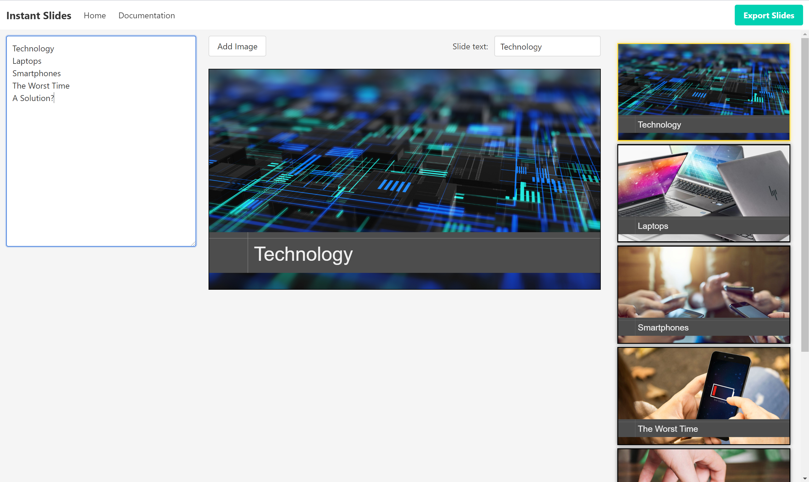

 

# Instant Slides
Do you need a quick set of concept-style slides for a presentation, and don't care about lots of text or charts or bullet points?

[Instant Slides](https://cwilkens.github.io/slides-generator/) is for you! It's a web-based slide generator, with simple inputs and editing capability.  
Just type in the titles of the slides, and drag-and-drop whatever background images you want. Hit Export, and you're done!

Type out the titles as the subjects of your talk come to you, with no pesky textbox selection or creating slides manually!  
Then, drag-and-drop your saved images, or images found online, right onto the slide to set it as the background automatically!

Features:  
* Line-delimited titles in a single textbox for quick editing
* Drag-and-drop images from your local machine or other websites, onto the editing slide or onto any slide in the list
* Quick export to .pptx format for additional editing or presenting

